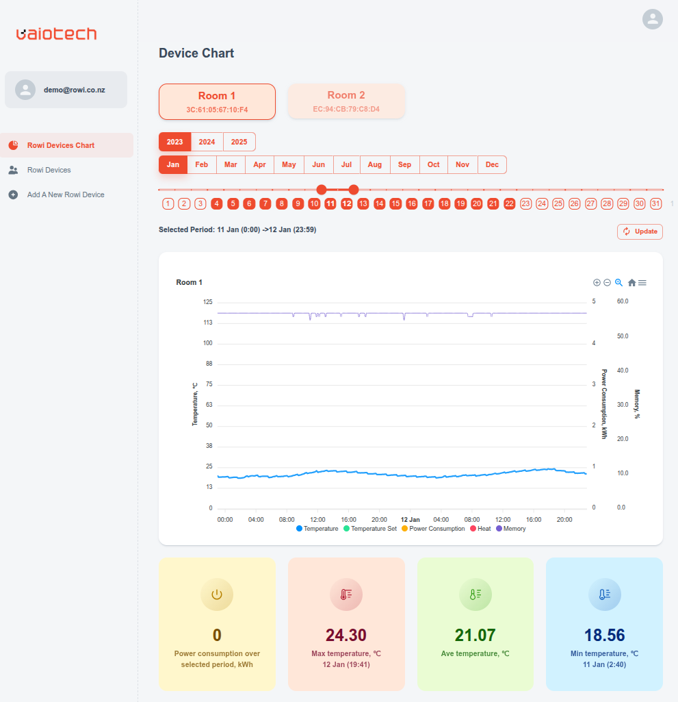
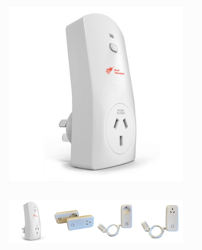

# Rowi UI

A real-time dashboard for monitoring and analyzing historical data from your IoT Rowi devices.

## 🚀 Features

- **Multi-Device Dashboard**: Add and monitor multiple Rowi devices from a single interface.
- **Real-Time Timeline Chart**: Visualize device metrics over time.
- **Key Parameter Tracking**: Monitor essential data points like temperature, power consumption, memory usage, and more.
- **Advanced Filtering**: Easily filter data by date, month, and year to analyze specific periods.

## 🛠️ Tech Stack

- **Frontend**: React.JS
- **UI Components**: MUI (Material-UI)
- **Backend & Hosting**: AWS Amplify

 ---

## 🔌 About the Rowi Device

The **Kiwi Warmer Rowi** is a professional IoT Automation Kit. It's a developer edition of the Kiwi Warmer Smart Plug, featuring:

- A powerful **Espressif ESP32 MCU**.
- An open **REST API**, **Mobile SDK**, and integration with the **ESPHome** ecosystem.
- The ability to control any electrical device connected to mains voltage.
- An integrated **SHTC3 temperature sensor**, accessible via HTTPS, MQTT, or ESPHome.

This dashboard is designed to harness the data from these powerful devices and present it in a clean, usable format.

For more information on the hardware, visit our partner's website:
[Rowi Smart Plug with API](https://www.vaiotech.co.nz/rowi-smart-plug-with-api/)

**Dashboard view**

**Rowi device**

